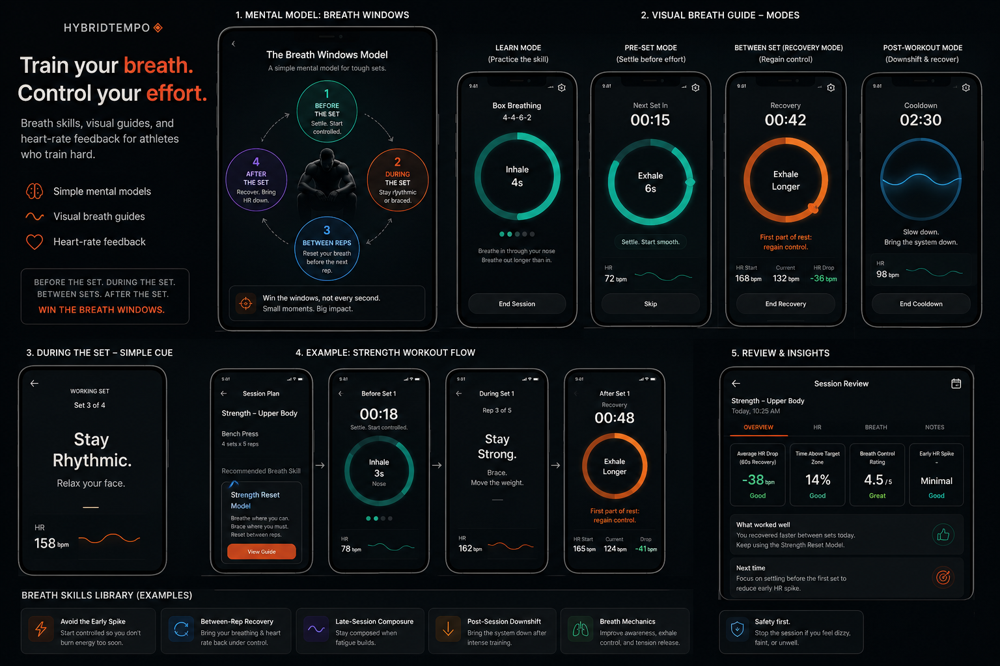

Below is an implementation-ready PRD you can drop into your repo as `docs/PRD.md` and use as the north star for building HybridTempo in Kotlin.

# PRD: HybridTempo — Breath Skills + Heart-Rate Recovery Coach

**Version:** 0.1 MVP
**Platform:** Android-first
**Primary stack:** Kotlin, Jetpack Compose, Health Connect, Room, DataStore, Coroutines, WorkManager
**Product direction:** Breath skills for athletes, taught through mental models and visual guides, measured against heart-rate control and recovery

## 1. Product summary

HybridTempo is an Android-first app that helps athletes learn, apply, and measure breath skills around training. The app recommends a breath skill based on workout context, teaches a simple mental model for remembering that skill during working sets, guides the athlete with visual breathing rhythms before, between, and after hard efforts, and uses heart-rate data to show whether the athlete is improving effort control, avoiding unnecessary heart-rate spikes, and recovering faster between hard efforts.

The current landing page already positions HybridTempo as “breathwork designed around how you train,” with training-context logging, recovery checks, matched breathwork recommendations, Android-first Health Connect/wearable support, and a “not a chatbot, a recommendation layer” concept. This PRD keeps that foundation but sharpens the product around **breath transfer into real training**, especially using heart-rate response and recovery as the feedback loop. 

## 2. One-line positioning

**HybridTempo teaches athletes which breath skill to use, how to remember it during working sets, and whether it is improving heart-rate control during training.**

## Design sketch reference: Breath Windows + Visual Breath Guides



The sketch direction adds a concrete teaching layer to the app:

* **Mental model:** athletes learn the Breath Windows model instead of trying to remember complex breathing rules mid-set.
* **Visual guide modes:** athletes can practice the rhythm in Learn mode, settle before a set in Pre-Set mode, recover between sets in Recovery mode, and downshift after training in Post-Workout mode.
* **Working-set cueing:** the app uses short cue cards during the set instead of long explanations.
* **Review loop:** the app connects the guide to heart-rate recovery, breath-control rating, early HR spike, and next-session recommendations.

Implementation note: keep this image at `docs/assets/breath-windows-ui-concepts.png` when the PRD lives at `docs/PRD.md`.

## 3. Product thesis

Athletes already track pace, reps, HRV, strain, and sleep, but many do not know how to use their breath during the hardest parts of training. Generic breathwork apps teach isolated breathing sessions, but they rarely connect breath practice to the athlete’s actual workout.

HybridTempo should fill that gap by becoming a **breath skill coach for hard training moments**.

The app should answer five practical questions:

1. **What breath skill should I use today?**
2. **What mental model helps me remember it during working sets?**
3. **When should I use it: before, during, between efforts, or after?**
4. **Did it help me control my heart rate and recover?**
5. **What should I practice next time?**

## 4. Problem statement

Serious athletes often experience breath breakdown during high-intensity training:

* They start too hard and spike heart rate early.
* They struggle to recover between intervals, rounds, or sets.
* Their breathing becomes tense, shallow, or panicked late in a session.
* They forget to breathe properly during working sets because the cue is not simple enough to survive fatigue.
* They do not know which moments matter most: before the set, during the set, between reps, after the set, or during the rest window.
* They finish workouts still wired and struggle to downshift.
* They have wearable data but do not know what it means for breath control.

Existing tools usually fall into one of two buckets:

**Wearables:** show data, but rarely teach what to do with the data.

**Breathwork/meditation apps:** teach breathing in isolation, but rarely connect it to sport-specific training context.

HybridTempo should combine both: **breath skill recommendation + mental-model coaching + visual breathing guidance + heart-rate recovery review**.

## 5. Goals

### Product goals

The MVP should:

1. Help athletes choose a breath skill for a specific workout context.
2. Teach athletes a simple mental model they can remember during working sets.
3. Provide visual breath guides that show the rhythm before, between, and after hard efforts.
4. Provide a small, structured library of athlete-focused breath skills.
5. Pull heart-rate and workout data from Health Connect where available.
6. Let athletes manually log subjective breath-control feedback.
7. Show post-workout insights based on heart-rate response and recovery.
8. Compare similar sessions over time.
9. Build trust by being conservative, transparent, and non-medical.

### Business goals

The MVP should validate whether athletes care about:

1. Breath skill recommendations tied to workout context.
2. Mental models that help athletes remember how to breathe during working sets.
3. Visual breath guides that make the technique immediately understandable.
4. Heart-rate recovery as proof that breath training is working.
5. A library organized around athletic use cases instead of generic relaxation.
6. Android-first wearable integration as a differentiator.

### Technical goals

The MVP should:

1. Use a local-first data model.
2. Integrate Health Connect first, not direct Fitbit/Garmin/WHOOP APIs.
3. Avoid relying on real-time sensor streaming in the first phone-only MVP.
4. Implement the first visual guide as an on-device Compose animation that works without Health Connect.
5. Make later Wear OS support straightforward.
6. Keep recommendation logic deterministic and testable before adding complex AI.

Health Connect is the right first integration layer because Android’s official docs describe it as a platform for storing and structuring health and fitness data across categories like activity, sleep, vitals, and wellness. It also requires explicit permissions for the data types the app uses. ([Android Developers][1])

## 6. Non-goals

The MVP should **not** try to do everything.

Out of scope for v0.1:

* No medical diagnosis.
* No “your breathing technique was objectively correct” claims.
* No aggressive breath holds.
* No hyperventilation-based protocols.
* No underwater breathwork.
* No direct Garmin/Fitbit/WHOOP API integrations in MVP.
* No full training plan builder.
* No nutrition coaching.
* No VO2 max prediction.
* No AI chatbot as the core UX.
* No live real-time HR coaching from phone-only Health Connect.

Health Connect is best treated as the source for structured health/workout records. Real-time heart-rate capture during a workout should be handled later through a Wear OS module using Health Services, because Android’s Health Services docs say Wear OS apps can register for metrics such as heart rate, distance, calories, speed, and pace directly from Health Services. ([Android Developers][2])

## 7. Target users

### Primary persona: serious hybrid athlete

**Profile:** Trains running, strength, conditioning, intervals, tempo work, or sport-specific conditioning.
**Problem:** Wants to stay controlled during hard sessions and recover better between efforts.
**Current behavior:** Tracks workouts using a watch or phone, but does not know how to connect breathwork to performance.
**Desired outcome:** “I want to know whether my breathing is helping me control effort.”

### Secondary persona: endurance athlete

**Profile:** Runner, cyclist, rower, triathlete, or field-sport athlete.
**Problem:** Heart rate spikes too early, breathing gets ragged during threshold work, or recovery between intervals is poor.
**Desired outcome:** “Help me stay composed and avoid burning myself too early.”

### Secondary persona: strength/conditioning athlete

**Profile:** Does CrossFit-style conditioning, strength circuits, sleds, assault bike, intervals, or heavy lifts.
**Problem:** Breathing and tension management break down under fatigue.
**Desired outcome:** “Help me reset between sets and recover between rounds.”

## 8. Core product concept

HybridTempo has four pillars:

### Pillar 1: Recommend

The app recommends one breath skill for the athlete’s current training context.

Example:

> “Today’s skill: Between-Rep Recovery. Use this after each hard interval to bring your heart rate down faster.”

### Pillar 2: Model

The app gives the athlete a simple mental model that can survive fatigue. The default model is **Breath Windows**:

> Do not try to breathe perfectly during every second of a hard set. Win the breath windows.

The four Breath Windows are:

1. **Before the set:** settle.
2. **During the set:** stay rhythmic or brace when needed.
3. **Between reps:** reset before the next rep.
4. **After the set:** recover before the next effort.

Example:

> “Breathe where you can. Brace where you must. Reset between reps.”

### Pillar 3: Guide

The app shows a visual breathing rhythm before, between, and after tough sets so the athlete can learn the pattern without reading long instructions.

Example:

> “Next set in 15 seconds. Exhale longer. Settle. Start smooth.”

During the working set itself, the app should use one short cue, not a full lesson.

Example:

> “Stay rhythmic. Relax your face.”

### Pillar 4: Measure

The app reviews heart-rate data and subjective feedback after the workout.

Example:

> “Your average 60-second HR recovery was 21 bpm today. Your last 3 similar interval sessions averaged 15 bpm. Breath-control rating also improved from 2/5 to 4/5.”

## 9. MVP product name for the main feature

The main feature should be called:

# Breath Impact Review

This is the key product loop.

**Input:** Workout context + breath skill + heart-rate data + user reflection
**Output:** A simple insight explaining whether breath control appears to be improving

Alternative names:

* Recovery Review
* Breath Transfer Score
* HR Recovery Coach
* Breath Control Review

My recommendation is **Breath Impact Review** because it communicates outcome without sounding too clinical.

## 10. MVP user journey

### Journey A: First-time onboarding

1. User opens HybridTempo.
2. App explains the product:

   > “Train your breath for hard efforts, recovery between reps, and post-session downshifting.”
3. App asks what the user trains:

   * Running
   * Cycling
   * Rowing
   * Hybrid/conditioning
   * Strength
   * Team sport
   * Other
4. App asks the user’s main breath problem:

   * I start too hard
   * I cannot recover between reps
   * My breathing breaks down late
   * I feel wired after training
   * I get nervous before races/events
   * I am not sure
5. App asks whether to connect Health Connect.
6. App shows a clear permissions rationale.
7. User lands on the **Today** tab.

Health Connect access depends on Android version: Android 14+ includes Health Connect as part of the Android framework, while Android 13 and lower require the Health Connect app from Google Play; the SDK supports Android 8/API 26+, but the Health Connect app is compatible with Android 9/API 28+. ([Android Developers][3])

### Journey B: Before a hard workout

1. User opens **Today**.
2. App asks:

   * What are you training today?
   * How hard is it intended to be?
   * How much time do you have?
   * Energy level?
   * Soreness?
3. App recommends one breath skill.
4. User taps **Start Primer**.
5. App gives a 2–3 minute primer.
6. App shows a workout cue card the user can remember.

Example:

> **Today’s Skill:** Avoid the Early Spike
> **Use when:** Warmup + first interval
> **Cue:** Start controlled. Do not chase air early.
> **Goal:** Keep the first third of the session smoother than usual.

### Journey C: After a workout

1. App detects or asks user to select a recent workout from Health Connect.
2. User confirms the session.
3. App asks:

   * Did your breath feel controlled?
   * When did breath break down?
   * Did you use the cue?
   * Was the limiter breath, legs, pacing, heat, or fatigue?
4. App calculates heart-rate metrics.
5. App shows Breath Impact Review.
6. App recommends what to repeat or change next time.

### Journey D: Library use

1. User opens **Train** tab.
2. User browses by athletic problem:

   * Avoid early HR spike
   * Recover between reps
   * Stay controlled during tempo
   * Downshift after training
   * Race/event composure
   * Breath mechanics
3. User opens a breath skill.
4. App shows:

   * What it helps with
   * When to use it
   * How to practice
   * How HybridTempo measures it
5. User can save it or start a session.


### Journey E: Breath Windows and visual guide use

1. User starts a recommended breath skill before a working set.
2. App shows the **Breath Windows** model for that workout:
   * Before the set: settle.
   * During the set: rhythm or brace.
   * Between reps: reset.
   * After the set: recover.
3. User taps **Start Visual Guide**.
4. App runs a short visual guide based on the moment:
   * Learn mode for practicing the skill while calm.
   * Pre-set mode for settling before effort.
   * Between-set recovery mode for regaining control.
   * Post-workout mode for downshifting after training.
5. During the actual working set, the app shows or reminds the athlete of one simple cue.
6. After the set or session, the app reviews heart-rate recovery and asks whether the cue helped.

## 11. App navigation

MVP should use four main tabs:

### 1. Today

Purpose: daily recommendation and workout context.

Contains:

* Recommended breath skill
* Recommended mental model
* Visual guide CTA
* “Plan workout” CTA
* Recent recovery signal
* Last Breath Impact Review
* Quick manual check-in

### 2. Train

Purpose: breath skills library.

Contains:

* Skill categories
* Individual breath exercises
* Mental models
* Visual guide patterns
* Saved/favorite skills
* Recently used skills

### 3. Review

Purpose: heart-rate recovery and breath-control insights.

Contains:

* Recent workouts
* Breath Impact Reviews
* HR recovery trends
* Visual guide session history
* Similar-session comparisons
* Breath breakdown history

### 4. Settings

Purpose: permissions, profile, safety, privacy, integrations.

Contains:

* Health Connect status
* Data permissions
* Privacy policy
* Export/delete data
* Training profile
* Notification preferences
* Safety guidance

## 12. Feature requirements

# Feature 1: Onboarding

## Purpose

Collect enough context to personalize the first recommendation without making onboarding feel heavy.

## Requirements

The app must collect:

* Name or nickname: optional
* Primary training types
* Main breath challenge
* Typical training intensity
* Preferred session length
* Wearable/Health Connect status
* Whether user wants reminders

## Onboarding screens

### Screen 1: Value proposition

Title:

> Train your breath for hard efforts.

Subtitle:

> HybridTempo helps you control effort, recover between reps, and downshift after training.

CTA:

> Get started

### Screen 2: Training type

Question:

> What do you train most?

Options:

* Running
* Cycling
* Rowing
* Strength
* Conditioning
* Hybrid
* Team sport
* Other

Multiple selection allowed.

### Screen 3: Main challenge

Question:

> Where does your breathing usually break down?

Options:

* I start too hard
* I struggle between reps
* I lose control late
* I stay wired after training
* Race/event nerves
* I am not sure

### Screen 4: Health Connect

Title:

> Connect your heart-rate data

Body:

> HybridTempo uses heart-rate data to show whether your breath practice is helping you control effort and recover. You can use the app manually without connecting.

CTA:

> Connect Health Connect

Secondary:

> Skip for now

## Acceptance criteria

* User can finish onboarding without Health Connect.
* User can select multiple training types.
* User can change onboarding answers later.
* Health Connect permissions are requested only after showing a rationale.
* App does not request unnecessary data types.

Google Play’s Health Connect publishing guidance says apps should request only data types that support specific user-facing features, provide clear justification for each permission, complete the Data Safety section, and submit the Health Apps declaration in Play Console. ([Android Developers][4])

# Feature 2: Health Connect integration

## Purpose

Import workout and heart-rate data to calculate post-workout breath impact.

## MVP integration scope

Read only:

* Exercise sessions
* Heart rate
* Resting heart rate, if available
* Sleep session, optional v0.2
* HRV, optional v0.2 if available

Write:

* None in v0.1 unless you want to save mindfulness/breathwork sessions later.

## Required permissions

MVP likely needs:

```xml
<uses-permission android:name="android.permission.health.READ_EXERCISE" />
<uses-permission android:name="android.permission.health.READ_HEART_RATE" />
<uses-permission android:name="android.permission.health.READ_RESTING_HEART_RATE" />
```

Optional later:

```xml
<uses-permission android:name="android.permission.health.READ_SLEEP" />
<uses-permission android:name="android.permission.health.READ_HEART_RATE_VARIABILITY" />
```

Do not request sleep or HRV in MVP unless the UI actually uses them.

## Important Health Connect constraints

Health Connect can read records only up to 30 days prior to the time permission was granted unless the app has the additional historical-read permission. For MVP, avoid asking for historical access at first; start with “from today forward” and use the normal permission set. ([Android Developers][3])

## Data sync behavior

MVP should use a manual and semi-automatic sync model:

* Manual: user taps **Import recent workout**.
* Automatic: background sync for recent sessions if permissions are granted.
* Fallback: user can manually create a workout if no Health Connect data is available.

Use WorkManager for reliable background import jobs that should survive app exits or device restarts. Android’s docs describe WorkManager as the recommended Jetpack library for persistent tasks and note support for one-time, long-running, and periodic work. ([Android Developers][5])

## Acceptance criteria

* App detects Health Connect availability.
* App handles denied permissions gracefully.
* App can read recent workouts.
* App can read heart-rate samples within a selected workout time range.
* App does not crash if HR data is missing or sparse.
* App labels sensor data as “estimated from wearable data” rather than absolute truth.

# Feature 3: Workout context planner

## Purpose

Let the user tell HybridTempo what kind of workout they are about to do.

## Inputs

Workout type:

* Intervals
* Tempo/threshold
* Long endurance
* Easy recovery
* Strength
* Conditioning
* Race/event
* Mobility/recovery
* Other

Planned intensity:

* Easy
* Moderate
* Hard
* Max effort / competition

Time available:

* 2 minutes
* 5 minutes
* 10 minutes
* 15+ minutes

State check:

* Energy: 1–5
* Soreness: 1–5
* Stress: 1–5
* Sleep quality: 1–5
* Motivation: 1–5

Optional:

* Planned duration
* Planned distance
* Planned intervals
* Planned target HR zone
* Planned pace/power
* Time of day

## Output

The planner returns:

* Recommended breath skill
* Recommended primer
* During-workout cue
* Post-workout reflection prompt
* Measurement focus

Example output:

```text
Workout: Intervals
Intensity: Hard
State: Moderate soreness, low stress
Recommended Skill: Between-Rep Recovery
Primer: 3-minute recovery breathing primer
During Cue: First 20 seconds of rest = regain control
Measurement Focus: 60-second heart-rate recovery between reps
```

## Acceptance criteria

* User can create a workout plan in under 45 seconds.
* App recommends exactly one primary skill.
* App explains why the skill was chosen.
* User can override the recommendation.

# Feature 4: Breath Skills Library

## Purpose

Provide the content foundation behind the recommendation engine.

## Library principle

The library should be organized by **athlete problem**, not breathing technique name.

Weak:

> Box breathing
> Coherent breathing
> Nasal breathing

Strong:

> Recover between reps
> Avoid early heart-rate spike
> Downshift after conditioning
> Stay controlled during tempo

## MVP categories

### Before training

* Avoid the Early Spike
* Pre-Interval Control
* Tempo Rhythm Primer
* Race/Event Composure
* Warmup Breath Check

### During training

* Between-Rep Recovery
* Between-Set Reset
* Late-Session Composure
* Rhythm Under Fatigue
* Relax the Tension Chain

### After training

* Post-Conditioning Downshift
* Post-Run Recovery
* Evening Training Wind-Down
* Recovery-Day Reset

### Skill basics

* Exhale Control
* Breath Awareness
* Jaw/Shoulder Relaxation
* Breathing Under Discomfort
* Recognizing Breath Breakdown

## Breath skill content model

Each library item should include:

```text
id
title
category
athlete_problem
best_for_workout_types
avoid_when
duration_options
difficulty
goal
instructions
pre_workout_cue
during_workout_cue
post_workout_prompt
measurement_focus
safety_notes
```

## Example library item

### Title

Between-Rep Recovery

### Athlete problem

> “I cannot bring my breathing or heart rate down between hard efforts.”

### Best for

* Running intervals
* Bike intervals
* Rowing intervals
* Conditioning circuits
* Team-sport conditioning

### Goal

> Improve the ability to downshift during rest periods.

### Duration

* 2-minute primer
* 5-minute practice
* Workout cue only

### Instructions

> During the rest period, relax the jaw and shoulders. Let the first few breaths be about regaining control, not forcing air. Make the exhale slightly longer than the inhale without straining.

### During-workout cue

> First part of rest: regain control.

### Measurement focus

> 60-second HR recovery after each hard effort.

### Safety note

> Do not hold your breath or force breathing during intense exercise. Stop if you feel dizzy, faint, or unwell.

## Acceptance criteria

* MVP ships with 12–20 high-quality breath skills.
* Every skill maps to a training use case.
* Every skill includes a measurable intention.
* No skill requires risky breath holds or hyperventilation.
* User can start a skill from the library or receive it as a recommendation.

# Feature 5: Recommendation engine

## Purpose

Choose the right breath skill for the athlete’s current context.

## MVP approach

Use deterministic rule-based recommendations first. Do not start with an LLM/chatbot.

Your current landing page’s “not a chatbot, a recommendation layer” idea is correct. The product should feel like a coach making a clear recommendation, not like a blank prompt box. 

## Inputs

From user:

* Training type
* Intended intensity
* Time available
* Energy
* Soreness
* Stress
* Main breath challenge
* Recent breath-control rating

From Health Connect:

* Recent workouts
* Recent HR response
* Recent HR recovery
* Resting HR if available
* Similar session history

From app history:

* Skills used
* Skill completion
* Reflection answers
* Breath breakdown moments
* Improvement trends

## Recommendation scoring

Each breath skill gets a score.

Pseudo-logic:

```kotlin
score = 0

if (workoutType in skill.bestForWorkoutTypes) score += 30
if (userMainChallenge == skill.primaryChallenge) score += 25
if (intensity == HARD && skill.supportsHardTraining) score += 15
if (timeAvailable >= skill.minimumDuration) score += 10
if (recentBreathBreakdown == skill.targetBreakdownMoment) score += 15
if (recentHrrTrend == WORSENING && skill.measurementFocus == HR_RECOVERY) score += 10
if (soreness >= 4 && skill.isHighActivation) score -= 15
if (stress >= 4 && skill.isDownregulating) score += 10
if (skillUsedRecentlyTooOften) score -= 5
```

## Recommendation output

The app should output:

```kotlin
data class RecommendationResult(
    val skillId: String,
    val confidence: RecommendationConfidence,
    val reason: String,
    val primerDurationMinutes: Int,
    val workoutCue: String,
    val measurementFocus: MeasurementFocus
)
```

Confidence values:

```kotlin
enum class RecommendationConfidence {
    LOW,
    MEDIUM,
    HIGH
}
```

## Example recommendation reason

> “Recommended because you selected a hard interval session and your last similar workout showed slower recovery between reps 4–6.”

## Acceptance criteria

* Recommendation is explainable.
* User can see why the skill was chosen.
* User can choose another skill.
* Engine works without Health Connect.
* Engine improves when workout history exists.

# Feature 6: Pre-workout primer

## Purpose

Teach the user the breath skill before the session, while they are calm enough to learn.

## Format

Each primer should be short:

* 60 seconds
* 2 minutes
* 5 minutes

## Structure

Every primer follows the same template:

1. What this skill helps with
2. What usually goes wrong
3. What to do
4. One cue to remember
5. What HybridTempo will review after

## Example primer

Title:

> Avoid the Early Spike

Script:

> Today’s goal is to start controlled. In hard sessions, it is common to chase air too early and push the heart rate up before the work really demands it. During the warmup and first effort, keep the breath relaxed. Your cue is: start smooth, then build. After training, HybridTempo will look at how quickly your heart rate climbed early in the session.

## Acceptance criteria

* User can complete primer in under 3 minutes.
* User can skip primer and keep only the cue.
* Primer ends with one clear cue.
* Primer links to post-workout measurement.


# Feature 7: Breath Windows mental model + Visual Breath Tempo Guide

## Purpose

Teach athletes a simple mental model for remembering how to breathe during working sets, then support that model with a visual guide that shows the rhythm before, between, and after tough efforts.

## User problem

Athletes often understand breathing advice before the workout, but forget it when the working set gets hard. Long instructions fail under fatigue. The app should give them a model and cue that are simple enough to remember while heart rate, pressure, and discomfort are high.

## Core mental model: Breath Windows

The app should teach this principle:

> **Do not try to breathe perfectly during every second of a hard set. Win the breath windows.**

A working set has four practical breath windows:

| Window | Athlete job | Example cue |
|---|---|---|
| Before the set | Settle before effort starts | “Settle before you start.” |
| During the set | Stay rhythmic or brace when required | “Stay rhythmic.” / “Brace, then move.” |
| Between reps | Reset before the next rep | “Every rep has a reset.” |
| After the set | Start recovery immediately | “First part of rest: regain control.” |

The app should teach that breathing skill transfer comes from using the right window, not from trying to micromanage every breath during a maximal effort.

## Strength-specific mental model

For heavy or technical strength work, the app should use:

> **Breathe where you can. Brace where you must. Reset between reps.**

This is especially relevant for lifts where bracing matters. The app should avoid telling users to follow a fixed inhale/exhale count during heavy reps. Instead, it should cue preparation, bracing awareness, and between-rep reset.

## Conditioning and interval mental model

For intervals, circuits, and conditioning, the app should use:

> **Control the start. Win the recovery.**

This helps athletes avoid spiking too early, then use rest windows intentionally instead of simply gasping until the next effort.

## Tempo/endurance mental model

For tempo, threshold, and sustained efforts, the app should use:

> **Find rhythm before fatigue builds.**

This teaches athletes to find a sustainable breath rhythm early instead of waiting until breath control has already broken down.

## Visual Breath Tempo Guide

The visual guide is the interface that makes the mental model learnable. It should show breathing rhythm visually and pair it with one short cue.

The guide should not be a generic meditation animation. It should feel like a training tool.

## Visual guide modes

### Learn mode

Purpose:

> Practice the skill while calm.

Used for:

* Skill basics
* Breath awareness
* Exhale control
* Learning the Breath Windows model

UI behavior:

* Expanding/contracting ring or breath wave
* Inhale/exhale phase label
* Countdown timer
* One cue
* Optional short instruction below the visual

Example copy:

> “Practice the rhythm now. During the workout, you’ll only need the cue: first part of rest, regain control.”

### Pre-set mode

Purpose:

> Settle before effort starts.

Used for:

* Strength working sets
* First interval
* Conditioning rounds
* Race/event warmup

UI behavior:

* 10–30 second timer
* Slower visual rhythm
* Primary cue: “Settle. Start smooth.”
* Optional current HR if available

Example copy:

> “Do not start the set already fighting for air. Settle first, then work.”

### Working-set cue mode

Purpose:

> Keep the cue alive during the set without distracting the athlete.

Used for:

* Strength sets
* Tempo work
* Intervals
* Conditioning rounds

UI behavior:

* Large text cue only
* Minimal animation or none
* Optional HR display
* No long explanations

Example cues:

* “Stay rhythmic.”
* “Relax your face.”
* “Brace. Move.”
* “Hard does not mean uncontrolled.”

### Between-set recovery mode

Purpose:

> Help the athlete regain control during the first 30–60 seconds of rest.

Used for:

* Between intervals
* Between strength sets
* Between conditioning rounds
* After sled pushes, bike sprints, rowing intervals, circuits, or hard efforts

UI behavior:

* 30–90 second recovery timer
* Exhale-focused visual rhythm
* Optional HR start, current HR, and HR drop
* One recovery cue

Example copy:

> “First part of rest: regain control.”

Example metrics:

```text
HR Start: 168 bpm
Current: 132 bpm
HR Drop: -36 bpm
```

### Post-workout downshift mode

Purpose:

> Bring the athlete down after hard training.

Used for:

* Hard intervals
* Conditioning
* Evening sessions
* Race/event cooldown

UI behavior:

* 2–5 minute timer
* Slower breath wave or ring
* Current HR when available
* Downshift cue

Example copy:

> “Bring the system down before you leave the session.”

## Visual design principles

* Dark, athletic UI.
* High-contrast text.
* One primary cue per screen.
* Large timer and phase labels.
* Minimal mid-set UI.
* Orange emphasis for high-intensity/recovery cues.
* Blue/teal emphasis for calm rhythm and mechanics.
* Avoid clutter, charts, or dense text during training moments.

## Visual guide screen requirements

The visual guide screen must include:

* Guide title
* Current mode
* Animated visual: ring, wave, timer, or cue card
* Current phase: inhale, exhale, settle, brace, reset, recover, or downshift
* Countdown timer
* Primary cue
* Optional secondary cue
* Optional heart-rate display
* Stop/skip button
* Completion state

## Example visual guide screens from the concept sketch

### Mental model screen

Shows the four Breath Windows around an athlete silhouette:

1. Before the set
2. During the set
3. Between reps
4. After the set

Bottom copy:

> “Win the windows, not every second. Small moments. Big impact.”

### Learn mode screen

Shows a breathing ring with the current phase:

```text
Box Breathing
Inhale
4s
```

### Pre-set mode screen

Shows the next-set countdown and cue:

```text
Next Set In
00:15
Exhale
6s
Settle. Start smooth.
```

### Between-set recovery screen

Shows a recovery timer, visual rhythm, HR drop, and cue:

```text
Recovery
00:42
Exhale Longer
First part of rest: regain control.
HR Start: 168 bpm
Current: 132 bpm
HR Drop: -36 bpm
```

### Working-set cue screen

Shows only the useful cue:

```text
WORKING SET
Set 3 of 4

Stay Rhythmic.
Relax your face.

HR 158 bpm
```

### Session review screen

Shows whether the mental model and guide appear to be helping:

```text
Average HR Drop: -38 bpm
Time Above Target Zone: 14%
Breath Control Rating: 4.5/5
Early HR Spike: Minimal
```

## Breath guide pattern model

Each breath skill may have one or more guide patterns. A pattern defines the visual mode, timing, cue, and measurement focus.

```kotlin
data class BreathGuidePattern(
    val id: String,
    val skillId: String,
    val mentalModelId: String?,
    val mode: BreathGuideMode,
    val title: String,
    val inhaleSeconds: Int?,
    val exhaleSeconds: Int?,
    val totalDurationSeconds: Int,
    val primaryCue: String,
    val secondaryCue: String?,
    val visualStyle: BreathVisualStyle,
    val measurementFocus: MeasurementFocus,
    val safetyNotes: String
)
```

```kotlin
enum class BreathGuideMode {
    LEARN,
    PRE_SET,
    WORKING_SET_CUE,
    BETWEEN_SET_RECOVERY,
    POST_WORKOUT_DOWNSHIFT
}
```

```kotlin
enum class BreathVisualStyle {
    EXPANDING_RING,
    BREATH_WAVE,
    RECOVERY_TIMER,
    CUE_CARD
}
```

## Example pattern

```kotlin
BreathGuidePattern(
    id = "between_rep_recovery_60s",
    skillId = "between_rep_recovery",
    mentalModelId = "breath_windows",
    mode = BreathGuideMode.BETWEEN_SET_RECOVERY,
    title = "Recover Before the Next Effort",
    inhaleSeconds = 3,
    exhaleSeconds = 5,
    totalDurationSeconds = 60,
    primaryCue = "First part of rest: regain control.",
    secondaryCue = "Relax jaw and shoulders.",
    visualStyle = BreathVisualStyle.RECOVERY_TIMER,
    measurementFocus = MeasurementFocus.HR_RECOVERY_60,
    safetyNotes = "Do not force breathing or hold your breath. Stop if you feel dizzy, faint, or unwell."
)
```

## Animation requirements

MVP animation should be simple and reliable in Jetpack Compose:

* Use `Canvas`, `Animatable`, or Compose animation APIs.
* Do not depend on complex video assets.
* Ring expansion maps to inhale.
* Ring contraction maps to exhale.
* Breath wave can be used for post-workout downshift.
* Recovery timer can combine circular progress with HR drop.
* App should continue to function if animations are disabled by accessibility settings.

## Accessibility requirements

* Provide text labels for breathing phases.
* Do not rely on color alone.
* Respect reduced-motion preferences where possible.
* Keep cues readable from a distance.
* Support large font scaling without breaking the main timer/cue UI.
* Allow audio/haptic cues later, but do not require them in MVP.

## Safety requirements

The visual guide must not include:

* Max breath holds
* Hyperventilation prompts
* Underwater breathing prompts
* Blackout tolerance language
* “Push through dizziness” language

The guide must include stop/skip behavior and safety copy where appropriate:

> Stop the guide if you feel dizzy, faint, short of breath in an unusual way, or unwell.

## Acceptance criteria

* User can view the Breath Windows model from a recommended skill.
* User can view the Breath Windows model from the library.
* User can start a visual guide from a recommendation.
* User can start a visual guide from a library skill.
* Guide works without heart-rate data.
* If heart-rate data is available, recovery mode can show HR start, current HR, and HR drop.
* Each guide screen has exactly one primary cue.
* Working-set mode uses a cue card, not a complex animation.
* User can stop or skip the guide at any time.
* No guide uses aggressive breath holds or hyperventilation.

# Feature 8: During-workout cue system

## MVP scope

For v0.1, do **not** build full real-time HR coaching unless you are also building a Wear OS companion app.

MVP should support:

* Static cue card
* Lock-screen friendly cue text
* Optional timer-based reminders
* Launching the appropriate Visual Breath Tempo Guide before or between sets
* Manual “I used this cue” confirmation after workout

## Future scope

For v1.0+, add live Wear OS support using Health Services.

Important technical note: Wear OS Health Services data streams can vary across devices, and Android’s compatibility docs say sensors may deliver data at different frequencies and timestamps depending on hardware and sensor platform. Build live coaching to handle missing, batched, and unevenly timed data instead of assuming perfect one-second heart-rate samples. ([Android Developers][6])

## Cue types

### Before session

> Start controlled. Do not chase air early.

### During rest

> First part of rest: regain control.

### Late session

> Relax the face. Keep the rhythm.

### After session

> Downshift before you leave the workout.

## Acceptance criteria

* User can view the cue without starting a complex session.
* User can jump from the cue into the visual guide when appropriate.
* Cue is short enough to remember during training.
* User can enable/disable reminders.
* App does not distract during high-risk movement.

# Feature 9: Post-workout reflection

## Purpose

Capture subjective data that sensors cannot measure.

Heart-rate data can show response patterns, but it cannot know whether the athlete felt panicked, controlled, tense, or calm. The reflection layer is essential.

## Questions

Ask only 3–5 questions.

Required:

1. Did you use the cue?

   * Yes
   * Partly
   * No

2. How controlled did your breathing feel?

   * 1–5 scale

3. When did your breathing break down?

   * Did not break down
   * Warmup
   * Early
   * Middle
   * Final third
   * After workout

4. What limited you most?

   * Breath
   * Legs/muscles
   * Pacing
   * Heat
   * Stress/nerves
   * Sleep/fatigue
   * Other

Optional:

5. How hard did the session feel?

   * RPE 1–10

## Acceptance criteria

* Reflection takes under 30 seconds.
* User can skip.
* App can generate review with partial answers.
* Reflection answers are included in future recommendations.

# Feature 10: Heart-rate analysis

## Purpose

Measure whether breath skills appear to improve effort control and recovery.

This is the central differentiator.

Target heart-rate ranges should be treated as general training guides, not rigid rules. The American Heart Association describes moderate intensity as about 50–70% of maximum heart rate and vigorous intensity as about 70–85%, while noting these are averages and general guides. ([www.heart.org][7])

## MVP heart-rate metrics

### Metric 1: Early HR spike

Question:

> Did the athlete go too hard too early?

Calculation:

```text
early_window = first 20% of workout duration, capped at 10 minutes
hr_start = median HR during first 60 seconds
hr_early_peak = max HR during early_window
early_spike_bpm = hr_early_peak - hr_start
early_spike_rate = early_spike_bpm / minutes_to_peak
```

Insight examples:

> “Your heart rate rose faster than usual in the first 5 minutes.”

> “You started smoother than your last similar hard session.”

### Metric 2: Time above intended range

Question:

> Was the athlete above the intended effort range too long?

Inputs:

* User-selected intended intensity
* Estimated max HR
* Optional user-configured zones

Calculation:

```text
target_upper_bound = zone upper bound based on workout intent
time_above_target = total seconds HR > target_upper_bound
percent_above_target = time_above_target / workout_duration
```

Insight examples:

> “This was planned as controlled tempo, but you spent 24% of the session above the target range.”

> “You stayed inside the intended range more consistently than last time.”

### Metric 3: 60-second heart-rate recovery

Question:

> How quickly did HR drop after hard efforts?

Calculation for interval-like sessions:

```text
work_peak_hr = max HR in work segment
hr_after_60s = HR sample nearest 60 seconds after work segment ends
hrr_60 = work_peak_hr - hr_after_60s
```

If intervals are not explicitly available, detect peaks and recovery windows heuristically.

Insight examples:

> “Your average 60-second HR recovery was 21 bpm.”

> “Recovery improved by 6 bpm compared with your last 3 similar interval sessions.”

### Metric 4: Recovery consistency

Question:

> Did the athlete keep recovering throughout the session?

Calculation:

```text
hrr_values = [hrr_60_rep1, hrr_60_rep2, ...]
first_half_avg = average first half
second_half_avg = average second half
recovery_fade = first_half_avg - second_half_avg
```

Insight examples:

> “Your recovery faded late. Reps 5–6 showed slower downshifting.”

> “Recovery stayed consistent across the whole workout.”

### Metric 5: Cardiac drift

Question:

> Did HR climb while output stayed similar?

MVP requires pace, distance, speed, or power data. If unavailable, skip this metric.

Calculation:

```text
compare first_half_avg_hr vs second_half_avg_hr
compare first_half_output vs second_half_output
if output stable and HR rises significantly, flag drift
```

Insight examples:

> “Your heart rate climbed late while output stayed similar. Possible fatigue, heat, pacing, or recovery issue.”

### Metric 6: Breath-control correlation

Question:

> Does subjective breath control match HR patterns?

Inputs:

* Breath control rating
* Breath breakdown moment
* Early spike
* HRR
* Time above target

Insight examples:

> “You rated breath control 4/5, and your recovery between efforts also improved.”

> “You felt controlled, but HR stayed high between reps. Next time, focus on recovery during rest periods.”

## Similar-session comparison

A session is “similar” if it matches:

* Workout type
* Intended intensity
* Duration within ±30%
* Same sport if available
* Similar structure if intervals detected
* Similar time of day optional
* Similar environment optional later

Use at least 3 prior sessions where possible. If fewer than 3 exist, label insight as “early signal.”

## Insight confidence

Every insight should include confidence:

```kotlin
enum class InsightConfidence {
    LOW,
    MEDIUM,
    HIGH
}
```

Confidence rules:

* High: multiple similar sessions + good HR data coverage
* Medium: one or two comparable sessions + decent HR coverage
* Low: sparse data, first session, missing HR, or manual-only data

## Acceptance criteria

* App never claims causation from one workout.
* App uses language like “suggests,” “trending,” or “compared with similar sessions.”
* App handles missing HR samples.
* App labels low-confidence insights clearly.
* App can generate a useful review even without sensor data.

# Feature 11: Breath Impact Review

## Purpose

Convert metrics into one simple, understandable post-workout card.

## Review card structure

```text
Workout
Breath skill used
Main heart-rate signal
Subjective breath-control signal
Comparison to similar sessions
Takeaway
Next recommendation
```

## Example card

```text
Breath Impact Review

Workout:
6 × 800m intervals

Skill:
Between-Rep Recovery

What changed:
Your average 60-second HR recovery was 22 bpm.
Your last 3 similar interval sessions averaged 16 bpm.

Breath control:
You rated control 4/5 and said breathing broke down only in the final third.

Takeaway:
Your recovery between efforts is trending better when using this cue.

Next:
Repeat Between-Rep Recovery for your next interval session.
```

## Negative/neutral example

```text
Breath Impact Review

Workout:
Tempo run

Skill:
Avoid the Early Spike

What changed:
Your heart rate rose faster than your usual tempo sessions in the first 8 minutes.

Breath control:
You rated control 2/5 and said breathing broke down early.

Takeaway:
The cue may not have transferred yet, or the session may have started too aggressively.

Next:
Use the same cue again, but add a longer warmup and start the first third easier.
```

## Acceptance criteria

* Review is readable in under 20 seconds.
* Review includes one clear takeaway.
* Review avoids medical diagnosis.
* Review includes data confidence.
* Review leads into the next recommendation.

# Feature 12: Trends and progress

## Purpose

Show progress over time without overwhelming the athlete.

## MVP trend views

### Breath control trend

* Average breath-control rating over time
* Breakdown moment distribution
* Skill usage frequency

### HR recovery trend

* Average HRR60 for similar sessions
* Best recent HRR60
* Recovery consistency

### Effort control trend

* Early spike trend
* Time above intended range
* Cardiac drift when data exists

## Example insights

> “Your recovery between intervals has improved across the last 4 similar sessions.”

> “Breath breakdown is happening later in the workout than it did two weeks ago.”

> “You are still spiking early on tempo days. Keep practicing Avoid the Early Spike.”

## Acceptance criteria

* Trends require at least 3 relevant sessions.
* User can filter by workout type.
* App explains what each metric means.
* App does not rank the user against other athletes in MVP.

# Feature 13: Safety and trust

## Purpose

Keep the product credible, safe, and appropriate for athletes of different ages and ability levels.

## Safety principles

The app must:

* Avoid extreme breath holds.
* Avoid hyperventilation drills.
* Avoid underwater breathwork.
* Avoid “push through dizziness” messaging.
* Avoid diagnosing heart or respiratory conditions.
* Tell users to stop if they feel dizzy, faint, have chest pain, or feel unwell.
* Encourage users with health concerns to talk to a qualified professional.

## Safety copy

Use this in onboarding and settings:

> HybridTempo is a training support tool, not medical advice. Do not use breath exercises to push through dizziness, chest pain, faintness, or unusual symptoms. Stop training and seek help if you feel unwell.

## Protocol restrictions

Do not include:

* Maximum breath holds
* CO₂ tolerance tables
* Hyperventilation challenges
* Blackout-style challenges
* Underwater breathing practices
* “Ignore warning signs” cues

## Acceptance criteria

* Safety guidance is visible during onboarding.
* Each breath skill has safety notes.
* App avoids risky breathing protocols by default.
* App does not make disease-treatment claims.

# Feature 14: Privacy and data controls

## Purpose

Health data is sensitive. The app should build trust early.

## MVP privacy model

Use local-first, Firebase-backed storage:

* Room is the source of truth for structured app data on the device
* DataStore is the source of truth for lightweight preferences/settings on the device
* Firebase is the cloud sync, backup, auth, analytics, and crash-reporting layer
* Health Connect remains source of truth for external health data
* Core tracking should remain offline-tolerant when Firebase auth, network, rules, or billing are temporarily unavailable
* No selling or sharing health data
* Firebase Analytics/Crashlytics should be privacy-conscious and avoid raw HR data

## User controls

Settings must include:

* Disconnect Health Connect
* View granted permissions
* Delete local app data
* Export local data as JSON/CSV later
* Privacy policy
* Permissions rationale

Health Connect’s quick-start guidance requires manifest-declared permissions and a permissions-rationale activity/privacy policy link flow for Health Connect permission screens. ([Android Developers][3])

## Acceptance criteria

* User can use app without Health Connect.
* User can delete app-created local data.
* User can understand why each permission is requested.
* App requests minimum necessary permissions.

## 13. Technical architecture

# Recommended Android architecture

Use a modular, clean-ish architecture without overengineering.

```text
app/
  src/main/java/com/hybridtempo/
    core/
      database/
      datastore/
      healthconnect/
      analytics/
      permissions/
      time/
      util/
    domain/
      model/
      repository/
      usecase/
      recommendation/
      breathguide/
      hranalysis/
    data/
      local/
      healthconnect/
      repository/
      seed/
    feature/
      onboarding/
      today/
      train/
      guide/
      review/
      settings/
    ui/
      components/
      theme/
      navigation/
```

## Stack

### Kotlin

Primary language.

### Jetpack Compose

Use for all UI.

### Room

Store:

* User profile
* Breath skills
* Breath mental models
* Breath guide patterns
* Breath guide sessions
* Workout plans
* Reflections
* Imported workout summaries
* Derived HR metrics
* Insight cards
* Firebase sync status for records that need backup

### DataStore

Store:

* Onboarding completion
* Preference flags
* Unit settings
* Notification settings
* Last sync timestamp
* Firebase sync preference flags

### Firebase

Use Firebase for:

* Authentication
* Cloud backup and cross-device sync
* Analytics
* Crashlytics
* Remote Config later

Firebase should enhance reliability and continuity, not become the only place app state exists. User-facing writes should save locally first, update the UI immediately, then sync to Firebase in the background when available.

### Health Connect SDK

Use for:

* Reading exercise sessions
* Reading heart-rate records
* Reading resting HR later
* Optional sleep/HRV later

### WorkManager

Use for:

* Periodic recent-workout sync
* Post-workout insight generation
* Deferred analytics upload if analytics exists
* Data cleanup

WorkManager is appropriate for reliable background work that should continue if the app exits or the device restarts, but not for every immediate in-process task. Use coroutines for normal screen-level async work. ([Android Developers][5])

### Hilt

Use for dependency injection.

### Coroutines + Flow

Use for reactive data streams from repositories to ViewModels.

### Optional future Wear OS module

Use later for real-time heart-rate cueing.

```text
wear/
  healthservices/
  exercise/
  messaging/
  ui/
```

## Important integration decision

Do **not** build on Google Fit APIs as the core integration. Android docs currently state Google Fit APIs are supported until the end of 2026 and point developers toward migration paths, so Health Connect should be the primary Android health data layer. ([Android Developers][3])

## 14. Data model

Below is an implementation-ready domain model.

### UserProfile

```kotlin
data class UserProfile(
    val id: String,
    val displayName: String?,
    val birthYear: Int?,
    val primaryTrainingTypes: Set<TrainingType>,
    val mainBreathChallenge: BreathChallenge?,
    val estimatedMaxHeartRate: Int?,
    val restingHeartRate: Int?,
    val createdAt: Instant,
    val updatedAt: Instant
)
```

### TrainingType

```kotlin
enum class TrainingType {
    RUNNING,
    CYCLING,
    ROWING,
    STRENGTH,
    CONDITIONING,
    HYBRID,
    TEAM_SPORT,
    MOBILITY,
    OTHER
}
```

### WorkoutType

```kotlin
enum class WorkoutType {
    INTERVALS,
    TEMPO,
    LONG_ENDURANCE,
    EASY_RECOVERY,
    STRENGTH,
    CONDITIONING,
    RACE_EVENT,
    MOBILITY_RECOVERY,
    OTHER
}
```

### IntendedIntensity

```kotlin
enum class IntendedIntensity {
    EASY,
    MODERATE,
    HARD,
    MAX_EFFORT
}
```

### BreathChallenge

```kotlin
enum class BreathChallenge {
    EARLY_HR_SPIKE,
    POOR_BETWEEN_REP_RECOVERY,
    LATE_SESSION_BREAKDOWN,
    POST_SESSION_WIRED,
    PRE_EVENT_NERVES,
    UNKNOWN
}
```

### BreathSkill

```kotlin
data class BreathSkill(
    val id: String,
    val title: String,
    val category: BreathSkillCategory,
    val primaryChallenge: BreathChallenge,
    val bestForWorkoutTypes: Set<WorkoutType>,
    val durationOptionsMinutes: List<Int>,
    val difficulty: SkillDifficulty,
    val goal: String,
    val instructions: String,
    val preWorkoutCue: String,
    val duringWorkoutCue: String?,
    val postWorkoutPrompt: String,
    val defaultMentalModelId: String?,
    val defaultGuidePatternIds: List<String>,
    val measurementFocus: MeasurementFocus,
    val safetyNotes: String,
    val isActive: Boolean
)
```

### BreathSkillCategory

```kotlin
enum class BreathSkillCategory {
    BEFORE_TRAINING,
    DURING_TRAINING,
    AFTER_TRAINING,
    SKILL_BASICS
}
```

### MeasurementFocus

```kotlin
enum class MeasurementFocus {
    EARLY_HR_SPIKE,
    HR_RECOVERY_60,
    TIME_ABOVE_TARGET,
    RECOVERY_CONSISTENCY,
    CARDIAC_DRIFT,
    BREATH_CONTROL_RATING,
    POST_SESSION_DOWNSHIFT
}
```

### BreathWindow

```kotlin
enum class BreathWindow {
    BEFORE_SET,
    DURING_SET,
    BETWEEN_REPS,
    AFTER_SET,
    BETWEEN_SET_RECOVERY,
    POST_WORKOUT
}
```

### BreathMentalModel

```kotlin
data class BreathMentalModel(
    val id: String,
    val title: String,
    val subtitle: String,
    val bestForWorkoutTypes: Set<WorkoutType>,
    val primaryChallenge: BreathChallenge,
    val principle: String,
    val windows: List<BreathWindowInstruction>,
    val defaultCue: String,
    val safetyNotes: String,
    val isActive: Boolean
)
```

### BreathWindowInstruction

```kotlin
data class BreathWindowInstruction(
    val window: BreathWindow,
    val title: String,
    val instruction: String,
    val cue: String
)
```

### BreathGuideMode

```kotlin
enum class BreathGuideMode {
    LEARN,
    PRE_SET,
    WORKING_SET_CUE,
    BETWEEN_SET_RECOVERY,
    POST_WORKOUT_DOWNSHIFT
}
```

### BreathVisualStyle

```kotlin
enum class BreathVisualStyle {
    EXPANDING_RING,
    BREATH_WAVE,
    RECOVERY_TIMER,
    CUE_CARD
}
```

### BreathGuidePattern

```kotlin
data class BreathGuidePattern(
    val id: String,
    val skillId: String,
    val mentalModelId: String?,
    val mode: BreathGuideMode,
    val title: String,
    val inhaleSeconds: Int?,
    val exhaleSeconds: Int?,
    val totalDurationSeconds: Int,
    val primaryCue: String,
    val secondaryCue: String?,
    val visualStyle: BreathVisualStyle,
    val measurementFocus: MeasurementFocus,
    val safetyNotes: String,
    val isActive: Boolean
)
```

### BreathGuideSession

```kotlin
data class BreathGuideSession(
    val id: String,
    val workoutPlanId: String?,
    val workoutId: String?,
    val skillId: String,
    val patternId: String,
    val mode: BreathGuideMode,
    val startedAt: Instant,
    val endedAt: Instant?,
    val completedDurationSeconds: Int,
    val completionState: BreathGuideCompletionState,
    val heartRateStart: Int?,
    val heartRateEnd: Int?,
    val heartRateDrop: Int?
)
```

### BreathGuideCompletionState

```kotlin
enum class BreathGuideCompletionState {
    COMPLETED,
    SKIPPED,
    STOPPED_EARLY,
    AUTO_ENDED
}
```

### WorkoutPlan

```kotlin
data class WorkoutPlan(
    val id: String,
    val createdAt: Instant,
    val workoutType: WorkoutType,
    val intendedIntensity: IntendedIntensity,
    val plannedDurationMinutes: Int?,
    val energyRating: Int?,
    val sorenessRating: Int?,
    val stressRating: Int?,
    val selectedSkillId: String,
    val selectedMentalModelId: String?,
    val selectedGuidePatternId: String?,
    val recommendationReason: String,
    val cue: String
)
```

### ImportedWorkout

```kotlin
data class ImportedWorkout(
    val id: String,
    val externalId: String?,
    val source: WorkoutSource,
    val workoutType: WorkoutType?,
    val startedAt: Instant,
    val endedAt: Instant,
    val durationSeconds: Long,
    val averageHeartRate: Int?,
    val maxHeartRate: Int?,
    val distanceMeters: Double?,
    val activeCalories: Double?,
    val sourceAppName: String?
)
```

### WorkoutSource

```kotlin
enum class WorkoutSource {
    HEALTH_CONNECT,
    MANUAL,
    WEAR_OS_LIVE,
    UNKNOWN
}
```

### HeartRateSample

```kotlin
data class HeartRateSample(
    val workoutId: String,
    val timestamp: Instant,
    val bpm: Int
)
```

### PostWorkoutReflection

```kotlin
data class PostWorkoutReflection(
    val id: String,
    val workoutId: String,
    val workoutPlanId: String?,
    val skillId: String?,
    val usedCue: CueUsage,
    val breathControlRating: Int?,
    val breakdownMoment: BreathBreakdownMoment,
    val limiter: SessionLimiter?,
    val rpe: Int?,
    val notes: String?,
    val createdAt: Instant
)
```

### CueUsage

```kotlin
enum class CueUsage {
    YES,
    PARTLY,
    NO,
    SKIPPED
}
```

### BreathBreakdownMoment

```kotlin
enum class BreathBreakdownMoment {
    DID_NOT_BREAK_DOWN,
    WARMUP,
    EARLY,
    MIDDLE,
    FINAL_THIRD,
    AFTER_WORKOUT,
    UNKNOWN
}
```

### SessionLimiter

```kotlin
enum class SessionLimiter {
    BREATH,
    LEGS_OR_MUSCLES,
    PACING,
    HEAT,
    STRESS_OR_NERVES,
    SLEEP_OR_FATIGUE,
    OTHER
}
```

### HeartRateAnalysisResult

```kotlin
data class HeartRateAnalysisResult(
    val workoutId: String,
    val dataCoveragePercent: Double,
    val earlySpikeBpm: Int?,
    val earlySpikeRateBpmPerMinute: Double?,
    val timeAboveTargetSeconds: Long?,
    val percentAboveTarget: Double?,
    val averageHrr60: Double?,
    val recoveryFadeBpm: Double?,
    val cardiacDriftPercent: Double?,
    val confidence: InsightConfidence
)
```

### InsightCard

```kotlin
data class InsightCard(
    val id: String,
    val workoutId: String,
    val skillId: String?,
    val title: String,
    val summary: String,
    val primaryMetricLabel: String?,
    val primaryMetricValue: String?,
    val comparisonText: String?,
    val takeaway: String,
    val nextRecommendation: String,
    val confidence: InsightConfidence,
    val createdAt: Instant
)
```

## 15. Heart-rate analysis algorithm

### Step 1: Load workout

Input:

```kotlin
ImportedWorkout
List<HeartRateSample>
WorkoutPlan?
PostWorkoutReflection?
UserProfile
```

### Step 2: Clean HR data

Rules:

* Remove samples below 35 bpm or above 230 bpm unless user profile supports unusual values.
* Remove obvious duplicates.
* Sort by timestamp.
* Calculate data coverage:

  ```text
  coverage = seconds with nearby HR sample / workout duration
  ```
* If coverage below 40%, mark confidence low.

### Step 3: Determine target range

MVP options:

1. User-configured zones if available.
2. Estimated max HR if user provides age or max HR.
3. Default broad ranges based on intended intensity.

AHA-style general guide:

```text
Easy: below 60% estimated max HR
Moderate: 50–70%
Hard: 70–85%
Max effort: above 85%
```

Use conservative product copy because max HR formulas are only estimates.

### Step 4: Calculate metrics

Implement:

```kotlin
interface HeartRateAnalyzer {
    fun analyze(
        workout: ImportedWorkout,
        samples: List<HeartRateSample>,
        plan: WorkoutPlan?,
        userProfile: UserProfile
    ): HeartRateAnalysisResult
}
```

Functions:

```kotlin
fun calculateDataCoverage(...)
fun calculateEarlySpike(...)
fun calculateTimeAboveTarget(...)
fun calculateHrr60(...)
fun calculateRecoveryConsistency(...)
fun calculateCardiacDrift(...)
fun calculateInsightConfidence(...)
```

### Step 5: Compare similar sessions

```kotlin
interface SimilarWorkoutMatcher {
    fun findSimilarWorkouts(
        target: ImportedWorkout,
        history: List<ImportedWorkout>,
        limit: Int = 5
    ): List<ImportedWorkout>
}
```

Similarity score:

```text
+40 same workout type
+20 same intended intensity
+15 duration within 30%
+10 same training type
+10 same selected skill
+5 same time of day
```

### Step 6: Generate insight

```kotlin
interface InsightGenerator {
    fun generate(
        workout: ImportedWorkout,
        skill: BreathSkill?,
        analysis: HeartRateAnalysisResult,
        reflection: PostWorkoutReflection?,
        similarAnalyses: List<HeartRateAnalysisResult>
    ): InsightCard
}
```

## 16. UI requirements

# Today screen

## Components

* Greeting
* Today’s recommendation card
* Training context CTA
* Last review summary
* Health Connect connection status
* Quick start buttons

## Empty state

Title:

> Ready to train your breath?

Body:

> Tell HybridTempo what you are training today and get one breath skill to focus on.

CTA:

> Plan today’s session

# Plan session screen

## Components

* Workout type selector
* Intended intensity selector
* Time available selector
* Recovery state sliders
* Recommend button

## Output screen

* Skill title
* Why this skill
* Cue
* Start primer
* Save plan

# Primer screen

## Components

* Skill title
* Timer/progress
* Instruction text
* Cue card
* Finish button

# Breath Windows model screen

## Components

* Mental model title
* Short principle statement
* Four-window visual: before the set, during the set, between reps, after the set
* Window-specific cue cards
* Recommended guide pattern CTA
* Safety note

## Empty/fallback state

If no mental model is attached to the selected skill, default to the Breath Windows model.

# Visual breath guide screen

## Components

* Guide title
* Mode label: Learn, Pre-Set, Working Set, Between-Set Recovery, or Post-Workout
* Animated ring, breath wave, recovery timer, or cue card
* Current phase label
* Countdown timer
* Primary cue
* Optional secondary cue
* Optional heart-rate display
* Stop/skip button

# Between-set recovery guide screen

## Components

* 30–90 second recovery timer
* Exhale-focused visual rhythm
* HR start, current HR, and HR drop when available
* One recovery cue
* End recovery button
* Next-set cue

# Working-set cue screen

## Components

* Set/round label if available
* Large cue text
* Optional HR display
* Minimal progress indicator
* No long-form instruction text


# Train/library screen

## Components

* Category tabs
* Skill cards
* Search/filter
* Saved skills
* Recently used

# Skill detail screen

## Components

* Title
* Problem it solves
* Best for
* Instructions
* Cue
* Measurement focus
* Safety notes
* Start button

# Import workout screen

## Components

* Recent workouts list
* Source app
* Date/time
* Duration
* HR availability badge
* Select button

# Reflection screen

## Components

* Cue usage
* Breath control rating
* Breakdown moment
* Limiter
* Optional notes

# Review screen

## Components

* Breath Impact Review card
* HR chart or simple metric row
* Similar session comparison
* Next recommendation
* Save/share optional later

# Settings screen

## Components

* Profile
* Health Connect status
* Permissions explanation
* Privacy policy
* Delete data
* Safety
* App version

## 17. MVP seed library

Ship with these 15 skills.

### 1. Avoid the Early Spike

Category: Before training
Challenge: Early HR spike
Best for: intervals, tempo, race/event
Measurement: early HR spike
Cue: “Start smooth, then build.”

### 2. Between-Rep Recovery

Category: During training
Challenge: Poor between-rep recovery
Best for: intervals, conditioning
Measurement: HRR60
Cue: “First part of rest: regain control.”

### 3. Post-Conditioning Downshift

Category: After training
Challenge: Post-session wired
Best for: conditioning, hard intervals
Measurement: post-session HR trend, reflection
Cue: “Do not leave the session still revved.”

### 4. Tempo Rhythm Primer

Category: Before training
Challenge: late breakdown
Best for: tempo, threshold, endurance
Measurement: time above target, cardiac drift
Cue: “Find the rhythm before you chase speed.”

### 5. Late-Session Composure

Category: During training
Challenge: late-session breakdown
Best for: intervals, long endurance, conditioning
Measurement: final-third HR behavior, reflection
Cue: “Relax the face. Keep the rhythm.”

### 6. Between-Set Reset

Category: During training
Challenge: tension and poor recovery
Best for: strength, conditioning
Measurement: reflection, HR drop if available
Cue: “Reset before the next set.”

### 7. Warmup Breath Check

Category: Before training
Challenge: unknown
Best for: all
Measurement: early HR spike
Cue: “Calm first. Intensity second.”

### 8. Race/Event Composure

Category: Before training
Challenge: nerves
Best for: race/event
Measurement: pre-session reflection
Cue: “Stay ready without burning energy.”

### 9. Exhale Control Basics

Category: Skill basics
Challenge: poor recovery
Best for: all
Measurement: breath-control rating
Cue: “Let the exhale do the downshifting.”

### 10. Breath Awareness Scan

Category: Skill basics
Challenge: unknown
Best for: all
Measurement: subjective awareness
Cue: “Notice before you change.”

### 11. Relax the Tension Chain

Category: During training
Challenge: shallow/tense breathing
Best for: strength, tempo, conditioning
Measurement: reflection
Cue: “Jaw, shoulders, hands.”

### 12. Recovery-Day Reset

Category: After training
Challenge: recovery
Best for: easy/recovery days
Measurement: reflection
Cue: “Make easy feel easy.”

### 13. Evening Training Wind-Down

Category: After training
Challenge: post-session wired
Best for: evening hard sessions
Measurement: reflection, sleep later
Cue: “Shift out of training mode.”

### 14. Breathing Under Discomfort

Category: Skill basics
Challenge: late breakdown
Best for: hard sessions
Measurement: breakdown moment
Cue: “Hard does not mean uncontrolled.”

### 15. Cooldown HR Recovery

Category: After training
Challenge: elevated post-session HR
Best for: hard endurance, conditioning
Measurement: post-workout HR trend
Cue: “Downshift before you stop paying attention.”


## MVP seed mental models

Ship with these 5 mental models.

### 1. Breath Windows

Best for: all workout types  
Principle: “Win the breath windows, not every second.”  
Windows: before the set, during the set, between reps, after the set  
Default cue: “Small moments. Big impact.”

### 2. Strength Reset Model

Best for: strength, hybrid, conditioning  
Principle: “Breathe where you can. Brace where you must. Reset between reps.”  
Windows: pre-set settle, working-set brace, between-rep reset, after-set recovery  
Default cue: “Reset before the next rep.”

### 3. Interval Recovery Model

Best for: intervals, conditioning, rowing, cycling, running  
Principle: “Control the start. Win the recovery.”  
Windows: pre-interval settle, first third control, rest-window downshift, next-rep readiness  
Default cue: “First part of rest: regain control.”

### 4. Tempo Rhythm Model

Best for: tempo, threshold, long endurance  
Principle: “Find rhythm before fatigue builds.”  
Windows: warmup rhythm, early control, middle rhythm check, final-third composure  
Default cue: “Hard does not mean rushed.”

### 5. Conditioning Downshift Model

Best for: circuits, sled pushes, assault bike, mixed modal conditioning  
Principle: “Start smooth. Recover on purpose.”  
Windows: pre-round settle, mid-round cue, after-round downshift, next-round readiness  
Default cue: “Recover before you reload.”

## MVP seed visual guide patterns

Ship with these 8 visual guide patterns.

### 1. Breath Windows Learn Guide

Mode: Learn  
Duration: 120 seconds  
Visual: expanding ring  
Cue: “Win the windows, not every second.”  
Measurement: breath-control rating

### 2. Pre-Set Settle Guide

Mode: Pre-Set  
Duration: 20 seconds  
Visual: expanding ring  
Cue: “Settle before you start.”  
Measurement: early HR spike

### 3. Strength Working-Set Cue

Mode: Working Set Cue  
Duration: user-controlled  
Visual: cue card  
Cue: “Breathe where you can. Brace where you must.”  
Measurement: breath-control rating

### 4. Between-Rep Recovery 60

Mode: Between-Set Recovery  
Duration: 60 seconds  
Visual: recovery timer  
Cue: “First part of rest: regain control.”  
Measurement: HR recovery 60

### 5. Interval Start Control

Mode: Pre-Set  
Duration: 30 seconds  
Visual: expanding ring  
Cue: “Start smooth, then build.”  
Measurement: early HR spike

### 6. Late-Session Composure Cue

Mode: Working Set Cue  
Duration: user-controlled  
Visual: cue card  
Cue: “Relax your face. Keep the rhythm.”  
Measurement: breath breakdown moment

### 7. Post-Conditioning Downshift Guide

Mode: Post-Workout Downshift  
Duration: 180 seconds  
Visual: breath wave  
Cue: “Bring the system down.”  
Measurement: post-session downshift

### 8. Cooldown HR Recovery Guide

Mode: Post-Workout Downshift  
Duration: 300 seconds  
Visual: breath wave + HR display  
Cue: “Downshift before you stop paying attention.”  
Measurement: post-workout HR trend

## 18. Analytics events

Keep analytics minimal and privacy-conscious.

Track product events, not raw health metrics.

```text
onboarding_started
onboarding_completed
health_connect_prompt_viewed
health_connect_connected
health_connect_skipped
workout_plan_created
recommendation_viewed
primer_started
primer_completed
breath_windows_viewed
visual_guide_started
visual_guide_completed
visual_guide_skipped
working_set_cue_viewed
recovery_guide_started
recovery_guide_completed
skill_opened
reflection_completed
workout_imported
review_generated
settings_privacy_opened
```

Do **not** send raw heart-rate samples to analytics.

If you later add cloud sync, require explicit consent.

## 19. Success metrics

### Activation

* % users who complete onboarding
* % users who create first workout plan
* % users who complete first reflection
* % users who connect Health Connect

### Engagement

* Weekly workout plans created
* Weekly primers completed
* Weekly visual guides started
* Visual guide completion rate
* Recovery guide completion rate
* Library skills opened
* Reflections completed per user

### Retention

* D1 retention
* D7 retention
* D30 retention
* % users with 3+ Breath Impact Reviews

### Product validation

* % users who view Breath Impact Review
* % users who view the Breath Windows model
* % users who start a visual guide from a recommendation
* % users who return to same skill after review
* % users who report breath-control improvement
* % users who connect a workout source

### Quality

* Review generation failure rate
* Health Connect permission failure rate
* HR data coverage average
* Crash-free sessions

## 20. Acceptance criteria summary

The MVP is ready when:

1. User can onboard.
2. User can use app without Health Connect.
3. User can connect Health Connect.
4. User can create a workout plan.
5. App recommends one breath skill.
6. App recommends or attaches one mental model.
7. User can view the Breath Windows model.
8. User can complete a primer.
9. User can start and complete a visual breath guide.
10. User can import/select a recent workout.
11. App can read HR samples for that workout when available.
12. User can complete post-workout reflection.
13. App generates a Breath Impact Review.
14. App compares to similar sessions when enough data exists.
15. App handles missing data gracefully.
16. App has a breath skills library.
17. App has seed mental models and visual guide patterns.
18. App includes privacy and safety guidance.
19. App stores data locally.

## 21. Engineering milestones

# Milestone 1: Project foundation

Deliverables:

* Kotlin Android project
* Compose navigation
* App theme
* Hilt setup
* Room setup
* DataStore setup
* Basic tabs: Today, Train, Review, Settings
* Seed breath skills in local database

# Milestone 2: Onboarding + profile

Deliverables:

* Onboarding flow
* UserProfile persistence
* Training type selection
* Breath challenge selection
* Health Connect education screen
* Settings profile editor

# Milestone 3: Breath skills library

Deliverables:

* Skill list
* Skill detail
* Category filters
* Start primer button
* Seed content
* Safety notes

# Milestone 4: Recommendation engine

Deliverables:

* Workout planner
* Rule-based recommendation engine
* Recommendation reason text
* Cue card
* Save WorkoutPlan

# Milestone 5: Primer flow

Deliverables:

* Primer UI
* Duration options
* Completion tracking
* Cue output screen

# Milestone 6: Breath Windows + Visual Breath Tempo Guide

Deliverables:

* BreathMentalModel data model and seed records
* BreathGuidePattern data model and seed records
* BreathGuideSession persistence
* Breath Windows model screen
* Visual guide screen with expanding ring, breath wave, recovery timer, and cue card styles
* Learn, pre-set, working-set cue, between-set recovery, and post-workout modes
* Optional HR display in guide screens when data is available
* Safety copy and stop/skip behavior
* Unit tests for guide pattern selection and safe defaults

# Milestone 7: Health Connect integration

Deliverables:

* Availability check
* Permission request flow
* Permissions rationale activity
* Read recent exercise sessions
* Read heart-rate records
* Import workout screen

# Milestone 8: Reflection flow

Deliverables:

* Post-workout reflection form
* Breath-control rating
* Breakdown moment
* Limiter
* Link reflection to workout and skill

# Milestone 9: HR analysis

Deliverables:

* HR cleaning
* Data coverage
* Early spike metric
* HRR60 metric
* Time above target metric
* Similar-session matcher
* Unit tests

# Milestone 10: Breath Impact Review

Deliverables:

* Insight generator
* Review card UI
* Confidence label
* Next recommendation
* Review history

# Milestone 11: Polish + release prep

Deliverables:

* Empty states
* Error states
* Permission denied states
* Privacy policy screen
* Delete data
* Basic analytics
* Crash reporting
* Play Console health declaration prep

## 22. Suggested repository docs for Codex

Since you are using Codex, create repository-local documentation so it has the product and architecture context every time it works in the codebase. OpenAI’s Codex guidance says Codex can be guided by `AGENTS.md` files in the repository that explain how to navigate the codebase, run tests, and follow project practices. ([OpenAI][8])

Create:

```text
AGENTS.md
docs/PRD.md
docs/ARCHITECTURE.md
docs/HEALTH_CONNECT.md
docs/RECOMMENDATION_ENGINE.md
docs/BREATH_WINDOWS.md
docs/VISUAL_BREATH_GUIDE.md
docs/HR_ANALYSIS.md
docs/SAFETY_AND_PRIVACY.md
```

## 23. Suggested `AGENTS.md`

```markdown
# HybridTempo Agent Instructions

HybridTempo is an Android-first Kotlin app that teaches athletes breath skills, mental models, and visual breathing guides, then measures whether those skills improve heart-rate control and recovery during training.

## Product principles

- Recommend one breath skill at a time.
- Attach one simple mental model to each recommended skill when possible.
- Use visual guides before, between, and after hard efforts; use minimal cue cards during working sets.
- Organize content by athlete problems, not generic meditation categories.
- Health data must be handled conservatively and privately.
- Do not make medical claims.
- Do not add aggressive breath holds, hyperventilation, or unsafe breathing challenges.
- The app must work without Health Connect.
- Health Connect should enhance insights, not block core usage.

## Architecture

Use Kotlin, Jetpack Compose, Hilt, Room, DataStore, Coroutines, Flow, and WorkManager.

Feature packages:
- feature/onboarding
- feature/today
- feature/train
- feature/guide
- feature/review
- feature/settings

Domain packages:
- domain/model
- domain/recommendation
- domain/breathguide
- domain/hranalysis
- domain/usecase
- domain/repository

Data packages:
- data/local
- data/healthconnect
- data/repository
- data/seed

## Testing expectations

Add unit tests for:
- RecommendationEngine
- HeartRateAnalyzer
- BreathGuidePatternSelector
- SimilarWorkoutMatcher
- InsightGenerator

Do not depend on live Health Connect in unit tests. Use fake repositories and sample heart-rate data.

## Safety

Never add protocols that involve:
- Max breath holds
- Hyperventilation
- Underwater breathwork
- Pushing through dizziness or chest pain

Use safe language:
- "suggests"
- "may indicate"
- "trending"
- "compared with similar sessions"

Avoid:
- "proves"
- "diagnoses"
- "guarantees"
```

## 24. First Codex task prompt

Use this as your first implementation prompt:

```text
Build the foundation for HybridTempo, a Kotlin Android app using Jetpack Compose.

Implement:
1. Bottom navigation with four tabs: Today, Train, Review, Settings.
2. Basic app theme matching an athletic dark UI.
3. Domain models for UserProfile, WorkoutPlan, BreathSkill, BreathMentalModel, BreathGuidePattern, BreathGuideSession, ImportedWorkout, HeartRateSample, PostWorkoutReflection, HeartRateAnalysisResult, and InsightCard.
4. Room database entities and DAOs for breath skills, mental models, guide patterns, guide sessions, workout plans, imported workouts, reflections, HR analysis results, and insight cards.
5. A seed data loader with 15 breath skills, 5 mental models, and 8 visual guide patterns from docs/PRD.md.
6. A Train tab that lists breath skills by category and opens a skill detail screen.
7. A simple mental model detail screen for Breath Windows.
7. Unit tests for seed data integrity.

Follow AGENTS.md and keep the app local-first. Do not implement Health Connect yet.
```

## 25. Second Codex task prompt

```text
Implement the workout planning and recommendation engine.

Add:
1. Workout planner screen with workout type, intended intensity, time available, energy, soreness, and stress inputs.
2. RecommendationEngine that scores BreathSkill records using rules from docs/PRD.md.
3. Recommendation result screen showing skill title, mental model, reason, cue, measurement focus, Start Primer button, and Start Visual Guide button.
4. Save WorkoutPlan to Room, including selectedMentalModelId and selectedGuidePatternId.
5. Unit tests covering intervals, tempo, conditioning, recovery, and post-session downshift scenarios.

The recommendation engine must work without Health Connect.
```

## 26. Third Codex task prompt

```text
Implement Breath Windows and the Visual Breath Tempo Guide.

Add:
1. BreathMentalModel and BreathGuidePattern seed data from docs/PRD.md.
2. Breath Windows model screen showing before-set, during-set, between-reps, and after-set windows.
3. Visual guide screen using Jetpack Compose animation with four styles: expanding ring, breath wave, recovery timer, and cue card.
4. Guide modes: Learn, Pre-Set, Working Set Cue, Between-Set Recovery, and Post-Workout Downshift.
5. Start Visual Guide button from recommendation result and skill detail screens.
6. BreathGuideSession persistence in Room.
7. Optional HR display placeholders that work without Health Connect.
8. Stop/skip behavior and safety copy.
9. Unit tests for guide pattern selection and safe fallback behavior.

Do not implement aggressive breath holds, hyperventilation, or real-time Wear OS coaching in this task.
```

## 27. Fourth Codex task prompt

```text
Implement the Health Connect integration layer.

Add:
1. HealthConnectManager wrapper.
2. Availability check.
3. Permission rationale screen.
4. Permission request for READ_EXERCISE and READ_HEART_RATE only.
5. Recent workout import screen.
6. Read ExerciseSession records and HeartRateRecord samples for selected workout time ranges.
7. Graceful fallbacks for unavailable Health Connect, denied permissions, and missing HR data.
8. FakeHealthConnectRepository for tests.

Do not request sleep, HRV, or write permissions in this task.
```

## 28. Fifth Codex task prompt

```text
Implement post-workout reflection and Breath Impact Review.

Add:
1. Reflection screen after selected workout.
2. Breath control rating, cue usage, breakdown moment, limiter, and optional RPE.
3. HeartRateAnalyzer with early spike, HRR60, time above target, data coverage, and confidence.
4. SimilarWorkoutMatcher.
5. InsightGenerator that creates conservative, non-medical insight copy.
6. Review screen showing generated Breath Impact Review.
7. Unit tests for HR analysis edge cases, missing data, and similar-session comparison.
```

## 29. MVP release checklist

Before release:

* [ ] Onboarding complete
* [ ] Breath library seeded
* [ ] Mental models seeded
* [ ] Visual guide patterns seeded
* [ ] Recommendation engine tested
* [ ] Health Connect permissions minimal
* [ ] Privacy policy screen exists
* [ ] Permissions rationale implemented
* [ ] App works without Health Connect
* [ ] Visual guide works without Health Connect
* [ ] Working-set cue screen remains minimal and readable
* [ ] HR analysis handles sparse samples
* [ ] Safety copy visible
* [ ] No risky protocols
* [ ] Delete local data implemented
* [ ] Play Console Health Apps declaration prepared
* [ ] Data Safety section prepared
* [ ] Crash-free smoke test
* [ ] Unit tests passing

## 30. Final product direction

The strongest version of HybridTempo is not “a breathwork library.”

It is:

> **A breath skill coach that helps athletes remember how to breathe during working sets, control effort, recover between hard efforts, and see whether the work is transferring into training.**

The library matters, but the feedback loop is what makes the product special:

```text
Training context
→ recommended breath skill
→ mental model
→ visual breath guide
→ working-set cue
→ post-workout reflection
→ heart-rate recovery review
→ next recommendation
```

That loop is the product. The visual guide and Breath Windows model make the app easier to understand, easier to remember under fatigue, and more differentiated than a generic breathwork library.

[1]: https://developer.android.com/health-and-fitness/health-connect/data-types "Health Connect data types  |  Android health & fitness  |  Android Developers"
[2]: https://developer.android.com/health-and-fitness/health-services "Health Services on Wear OS  |  Android health & fitness  |  Android Developers"
[3]: https://developer.android.com/health-and-fitness/health-connect/get-started "Get started with Health Connect  |  Android health & fitness  |  Android Developers"
[4]: https://developer.android.com/health-and-fitness/health-connect/publish "Publish your health app on Google Play  |  Android health & fitness  |  Android Developers"
[5]: https://developer.android.com/develop/background-work/background-tasks/persistent "Task scheduling  |  Background work  |  Android Developers"
[6]: https://developer.android.com/health-and-fitness/health-services/compatibility "Enhance app compatibility across Wear OS devices  |  Android health & fitness  |  Android Developers"
[7]: https://www.heart.org/en/healthy-living/exercise-and-physical-activity/fitness-basics/target-heart-rates?utm_source=chatgpt.com "Target Heart Rates Chart"
[8]: https://openai.com/index/introducing-codex/?utm_source=chatgpt.com "Introducing Codex"
